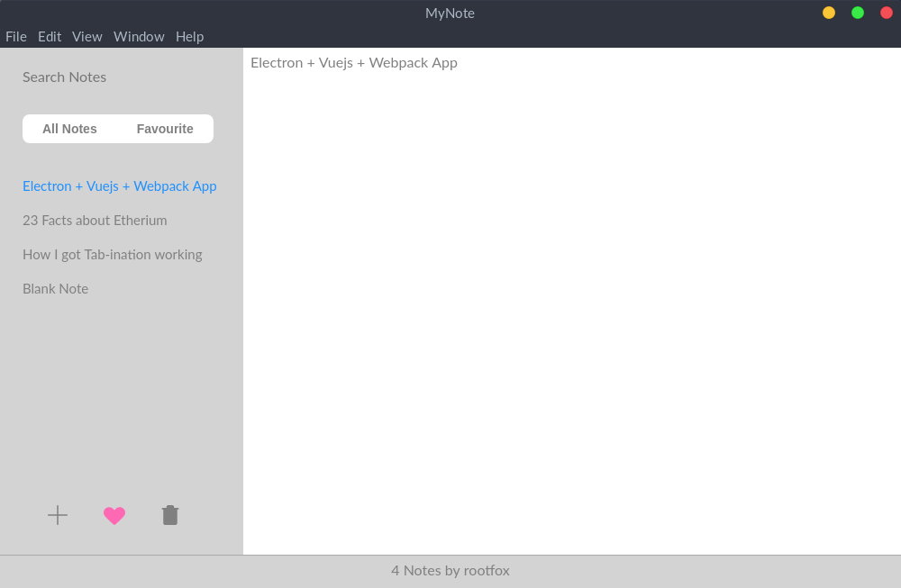

# MyNote

A Minimalist's Cross-Platform Notes App



It uses:
* [Node.js](https://nodejs.org/en/) for back-end
* [electron (used to be atom-shell)](https://github.com/atom/electron/) for embedded browser
* [Vue.js](https://vuejs.org/) as front-end framework with [Vuex](https://vuejs.org/vuex) as data-flow pattern

---

### Features

- Cross-platform Minimalist Notes app
- Notes & Favourites Management
- Auto Save/Sync notes
- Instant/Reactive Search bar
- status info Footer
- Sleep mode blocker
- Minimize to tray

---

### Releases notes

- [Releases notes](https://github.com/zero1729/mynote/releases)

---

### Run MyNote 

Note: make sure you already have [NodeJs](https://nodejs.org/en/) and [git](https://git-scm.com/) installed

Run the following commands in the Terminal

```sh
# Clone the repo
$ git clone https://github.com/Zero-1729/mynote/

# Go into repo and all install dependencies
$ cd mynote && npm install

# Webpack builds once and watches for changes in files to apply
$ npm run dev

# Run the app with Electron
$ npm start
```

---

### Installation

#### Regular

Builds can be found [at this page](https://github.com/zero1729/mynote/releases).

Note: Builds are comming soon!


#### Build (advanced)

Please consider that **`master` is unstable.**

- Download [Electron](https://github.com/atom/electron/releases)
- Download MyNote [source code](https://github.com/zero1729/mynote/)
- Put it in a folder called `app` in `[Electron path]/resources`
- `npm install && npm run dev`
- Run Electron

---

### Troubleshooting

MyNote is currently in development. Meaning certain parts of the app can break after an update (database schemes changes, config, etc ).

If you encounter any hiccups when starting the app or during use, you can reset MyNote by following the steps below:

- Go to your home folder directory
    - Windows: `%AppData%\mynote`
    - OSX: `~/Library/Application Support/mynote`
    - Linux: `~/.config/mynote/` or `$XDG_CONFIG_HOME/mynote`

- Delete:
    -
    - `IndexedDB` folder
    - `config.json` file

- Restart MyNote

If you still encounter problems after that, you're more than welcome to open an issue or a PR ;)

---

### Bug report

If you want to report a bug, Just go ahead! To help us, please indicate your OS, your MyNote version, and how to reproduce it (exactly if possibly). Adding a screenshot of the app's current state.

---

### Contribute

- Fork and clone
- Master is usually unstable, checkout to a tag to have a stable state of the app

- Install the latest version of electron either by running `npm install -g electron` or downloading the latest release available [here](https://github.com/electron/electron/releases) and just drop the app on `resources/` folder.
- You can use electron now with `electron [electronapp-dir]` command if you installed electron using npm or by running your downloaded electron.

- `npm install && npm run dev` then run in a separate terminal `npm start`
- `npm run dev` will watch for file changes using Webpack which will recompile Vue files.

- Open up DevTools

Please respect a few rules:

- Open an issue first to discuss about any major fixes or hacks.
- Make the code readable and comment where possible.


MIT &copy; Zero-1729
