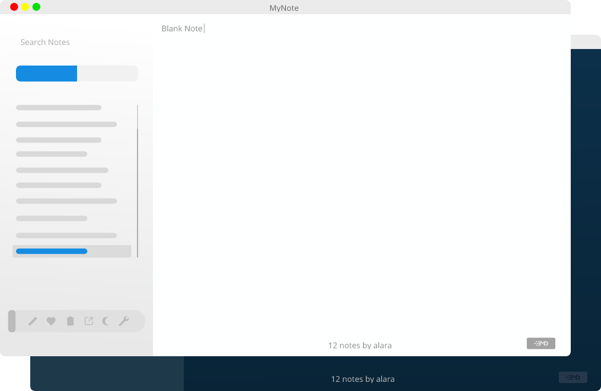

# MyNote

A Hybrid Minimalist's Cross-Platform Notes App

> Built with [Electron](https://github.com/atom/electron/), [Vue.js](https://vuejs.org/) with [Vuex](https://vuejs.org/vuex) + [Vue-Router](https://vuejs.org/vue-router)



---

### Features

- Supports Markdown Preview with KaTeX support; triggered by either `Shift+CommandOrControl+M` or clicking the markdown button in the bottom right corner of the Editor
- Code Syntax Highlight (in Markdown preview)
- Support for Emoji (markdown name) autocompletion using the Editor's Built-in Emoji markdown preprocessor (`AutoMoji`)
- Support for `GitHub` Flavoured Emojis (including the `GitHub Mark` and `Octocat`) and `EmojiOne`<sup>TM</sup> Emojis
- Notes Categorizer (Favourites & all Notes)
- Automatic Notes saving (`Save-On-Mutation`)
- Fuzzy Notes title Search bar
- In-Note reactive highlight search with support for `Regex`, `Whole Word`, `Case-Sensitive` and `Fuzzy` mode
- App Settings manager; to configure UI and Editor
- All changes in Settings manager are immediately effected; no need for restarting the App
- Auto Symbols Delimiter completion; auto closes opened `html tags`, and other Markdown/KaTeX opening symbols (`'`, `"`, \`, `$`, `^`, `~`, `*`, `(`, `{`, `[`)
- Auto Symbols Delimiter deletion when backspacing; only when `autoDelimiter` is set to `true` in settings
- The Built-in Editor has spellcheck capabilities; and underlines misspelled words in red
- The Spellcheck's dictionary can be changed to any of the nine (9) languages supported (`en`, `de`, `fr`, `es`, `nl`, `sv`, `pt`)
- Support for word suggestions for misspelled words; and replacement
- A handy Actions Toolset on the Sidepane; Triggered by `CommandOrControl+G` or clicking the pill looking button on the Sidepane
- Markdown HotKeys; I.e `Alt+Shift+M` inserts a (KaTeX) math block. [Click here](https://github.com/Zero-1729/mynote/app/src/public/docs/mynote_shortcuts.pdf) to get the full list of supported Shortcuts
- Collapsable Sidepane; For more space when note taking. Triggered by `CommandOrControl+h`
- Notes export to `MD`, `HTML`, and `PDF` (still experimental)
- Status info Footer; with estimated read time, creation and modification dates, and notes count
- Light/Night Mode; Toggle between the two using `CommandOrControl+T`
- Auto Night Mode; automatically changes to night mode in th evening (6 PM - 6 AM)
- Editor's writing area is padding to increase readability
- Sleep mode blocker
- Support for notes backing up and exporting as well as notes backup importing

---

### Releases notes

[Check out tags](https://github.com/Zero-1729/mynote/releases)

---

### Run MyNote

> Note: make sure you already have [NodeJs](https://nodejs.org/en/) and [git](https://git-scm.com/) installed

Run the following commands in the Terminal

```sh
# Clone the repo
$ git clone https://github.com/Zero-1729/mynote/

# Go into repo and install all dependencies
$ cd mynote && npm install

# Webpack builds once and watches for changes in files to apply
# Add '&' to command to run in background and continue watching files even after 'npm start'
# Or just regular 'npm run dev'
$ npm run dev &

# Run the app
$ npm start
```

---

### Installation

#### Regular

> Note: Builds are comming soon!

Builds can be found [at this page](https://github.com/Zero-1729/mynote/releases).

### Packaging

> To package app for your platform

```sh
# Clone the repo
$ git clone https://github.com/Zero-1729/mynote/

# Go into repo and install all dependencies
$ cd mynote && npm install

# Build App
# Replace 'platform' with your OS, e.g mac, win or Linux
# Replace 'arch' with your OS architecture, e.g 64-bit or 32-bit
$ npm run build:[platform]-[arch]
```

The built app will be in the `app/dist` folder.

---

### Bug report

If you want to report a bug or encounter any problems feel free to open an issue or a PR :wink:.

It would be very helpful if you:-

- please indicate your OS
- your MyNote version
- And how to reproduce it (exactly if possibly)
- Expected Behavior
- Adding a screenshot of the app's current state.

You can also include any possible solution(s) if you have any.

---

### Contribute

- Fork and clone
- **bleading** is usually unstable, and packed with the latest additions. The **master** branch is usually stable. To help out in the hacking clone **bleeding** and to fix possible chokes clone **master**.
- `npm install && npm run dev` then run in a separate terminal (window) `npm start`
- Open up the App's DevTools and have fun

Please respect the following rules:

- Open an issue first to discuss about any major fixes or possible hacks.
- No aggressive or degrading language would be tolerated in any discussion (issues, commits, etc).
- Make the code readable and comment where possible.

---

MIT &copy; Zero-1729
